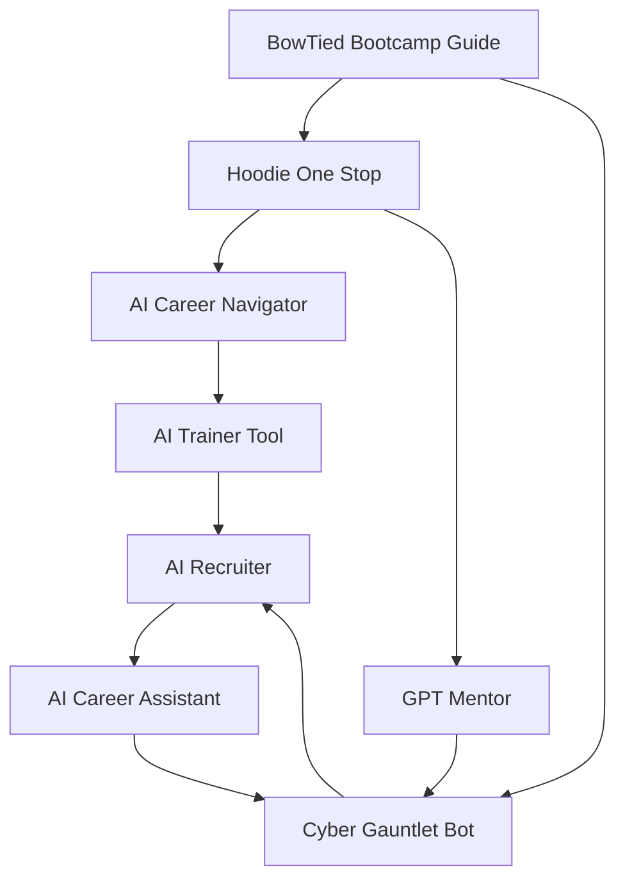

---

# BowTied Cyber AI Ecosystem 🚀

## Architecting the Future of Cybersecurity Education

As the **AI Architect** for Bow Tied Cyber, I designed and deployed a comprehensive suite of 8 interconnected AI-powered tools that revolutionize how prospects discover, students learn cybersecurity, develop careers, and compete in the field. This isn't just a collection of chatbots—it's a carefully orchestrated conversion and educational ecosystem that guides prospects from first interest through career mastery.

  

## 🏗️ System Architecture & Design Philosophy

### The Challenge
Traditional cybersecurity education suffers from:
- Fragmented learning experiences
- No clear career progression path
- Limited practical application
- Poor student engagement
- Lack of personalized guidance

### The Solution: Integrated AI Conversion & Education Ecosystem
I architected an eight-tool ecosystem where each component serves a specific purpose while seamlessly integrating with others to create a holistic journey from prospect interest to career mastery.

## 🛠️ The AI Tool Suite

### 0. **BowTiedCyber Bootcamp Guide** - Conversion Intelligence Engine
**Purpose**: High-conversion prospect qualification and funnel protection
- Built-for-conversion sales automation for high-agency cybersecurity learners
- Structured intake questioning with future-pacing and counter-signaling techniques
- Converts intent into measurable actions (Calendly bookings, Cyber Gauntlet trials)
- Strict brand protection: never discloses pricing, enforces official enrollment channels
- Command injection immunity: prevents social engineering of public-facing automation
- Produces intake summaries, candidate personas, and advisor playbooks for human closers
- Promotes internal AI tools as exclusive benefits to increase perceived value

**Innovation**: Trauma-free, no-nonsense coaching approach that reduces dead leads while maintaining compliance

### 1. **Hoodie One Stop** - Smart Intake Coordinator
**Purpose**: First contact and intelligent onboarding
- Eliminates traditional forms with conversational intake
- Auto-generates personalized student IDs (BTC-[Name]-2025-####)
- Smart timezone/location detection
- Routes students to appropriate tools based on profile

**Innovation**: Transforms boring enrollment into engaging first experience

### 2. **AI Career Navigator** - Strategic Assessment Engine
**Purpose**: Career readiness evaluation and roadmap creation
- Comprehensive career readiness scan with one command
- Strength & blocker analysis with actionable insights
- Custom roadmap generation based on transferrable skills
- Real-time job market intelligence integration
- Exports structured career assessment (career_nav.md)

**Innovation**: Replaces generic career advice with data-driven, personalized strategy

### 3. **AI Trainer Tool** - Interactive Learning Platform
**Purpose**: Master the AI tools themselves through guided practice
- Menu-driven navigation system
- Bite-sized learning modules with immediate feedback
- Hands-on simulation labs (learner and instructor modes)
- Command explorer with direct knowledge base references
- Accessibility optimized (ADHD, autism, dyslexia, ESL support)
- Exportable learning resources (Markdown, CSV, JSON)

**Innovation**: Meta-learning - teaching students to effectively use AI for career development

### 4. **AI Recruiter** - Interview Reality Simulator
**Purpose**: Interview preparation that feels authentic
- Upload resume + job description for tailored practice
- Multiple recruiter personality types (Supportive, Realistic, Challenging)
- Real-time feedback on clarity, technical accuracy, communication
- Ethical job search guidance and reference protection
- Progressive difficulty with warm-up to scenario-based challenges

**Innovation**: 360° interview preparation vs static Q&A, includes unethical recruiter scenarios

### 5. **AI Career Assistant** - 24/7 Personal Coach
**Purpose**: Daily career growth partnership
- Built on PRCM™ Labor Career Development System
- Expert coaching in proven frameworks (SARI, PARADE, SOAR, STAR, COMPASS)
- Crisis support and resilience strategies
- Live market insights with salary benchmarks
- SMART+ goal setting with milestone tracking
- Seamless integration with AI Recruiter for tactical execution

**Innovation**: Human-level coaching frameworks with real-time market intelligence

### 6. **GPT Mentor** - Prompt Engineering Mastery
**Purpose**: Teaching effective AI communication
- Adaptive learning based on skill level (Novice/Intermediate/Technical)
- Interactive teaching with analogies and guided logic checks
- Cognitive models: OODA Loop, Chain-of-Thought, Confirmation of Reasoning
- Session tagging and spaced repetition
- Integrated tools: browser, canvas, image generation, Python execution
- Exportable prompt libraries and session logs

**Innovation**: Living, adaptive mentor that evolves with user responses

### 7. **Cyber Gauntlet Bot** - Gamified Competition Arena
**Purpose**: Career readiness evaluation and roadmap creation
- Comprehensive career readiness scan with one command
- Strength & blocker analysis with actionable insights
- Custom roadmap generation based on transferrable skills
- Real-time job market intelligence integration
- Exports structured career assessment (career_nav.md)

**Innovation**: Replaces generic career advice with data-driven, personalized strategy

### 3. **AI Trainer Tool** - Interactive Learning Platform
**Purpose**: Master the AI tools themselves through guided practice
- Menu-driven navigation system
- Bite-sized learning modules with immediate feedback
- Hands-on simulation labs (learner and instructor modes)
- Command explorer with direct knowledge base references
- Accessibility optimized (ADHD, autism, dyslexia, ESL support)
- Exportable learning resources (Markdown, CSV, JSON)

**Innovation**: Meta-learning - teaching students to effectively use AI for career development

### 4. **AI Recruiter** - Interview Reality Simulator
**Purpose**: Interview preparation that feels authentic
- Upload resume + job description for tailored practice
- Multiple recruiter personality types (Supportive, Realistic, Challenging)
- Real-time feedback on clarity, technical accuracy, communication
- Ethical job search guidance and reference protection
- Progressive difficulty with warm-up to scenario-based challenges

**Innovation**: 360° interview preparation vs static Q&A, includes unethical recruiter scenarios

### 5. **AI Career Assistant** - 24/7 Personal Coach
**Purpose**: Daily career growth partnership
- Built on PRCM™ Labor Career Development System
- Expert coaching in proven frameworks (SARI, PARADE, SOAR, STAR, COMPASS)
- Crisis support and resilience strategies
- Live market insights with salary benchmarks
- SMART+ goal setting with milestone tracking
- Seamless integration with AI Recruiter for tactical execution

**Innovation**: Human-level coaching frameworks with real-time market intelligence

### 6. **GPT Mentor** - Prompt Engineering Mastery
**Purpose**: Teaching effective AI communication
- Adaptive learning based on skill level (Novice/Intermediate/Technical)
- Interactive teaching with analogies and guided logic checks
- Cognitive models: OODA Loop, Chain-of-Thought, Confirmation of Reasoning
- Session tagging and spaced repetition
- Integrated tools: browser, canvas, image generation, Python execution
- Exportable prompt libraries and session logs

**Innovation**: Living, adaptive mentor that evolves with user responses

### 7. **Cyber Gauntlet Bot** - Gamified Competition Arena
**Purpose**: Practical skill application through competition
- Red vs Blue team dynamics (Attack vs Defense)
- Gamified XP system with badges and streaks
- Lean Manufacturing principles applied to learning
- Canvas-based coding solutions with automatic evaluation
- Comprehensive tracking system with synthetic exports
- Career progression rewards (resume makeovers, coaching sessions)
- Anti-cheating enforcement with strike system

**Innovation**: Transforms learning into competitive, measurable skill development

## 🔄 Integration & Workflow Design

### Student Journey Architecture
1. **Conversion**: BowTiedCyber Bootcamp Guide qualifies prospects and drives enrollment
2. **Entry**: Hoodie One Stop captures and profiles enrolled students
3. **Assessment**: Career Navigator evaluates readiness and creates roadmap
4. **Training**: Trainer Tool builds AI proficiency
5. **Practice**: AI Recruiter simulates real scenarios
6. **Support**: Career Assistant provides ongoing guidance
7. **Mastery**: GPT Mentor develops advanced AI skills
8. **Application**: Cyber Gauntlet applies skills competitively

### Cross-Tool Intelligence
- **Conversion Funnel**: Bootcamp Guide qualifies prospects and feeds enrollment data to Hoodie One Stop
- **Shared Student Profiles**: Each tool can reference previous assessments and conversion touchpoints
- **Progressive Difficulty**: Tools adapt based on demonstrated competency from conversion through mastery
- **Seamless Handoffs**: Smart routing between tools based on prospect/student needs and readiness
- **Unified Tracking**: Comprehensive progress monitoring from first interest through career placement
- **Brand Protection**: Consistent messaging and funnel hygiene across all prospect touchpoints

## 📊 Technical Innovation Highlights

### AI Architecture Decisions
- **Platform Choice**: ChatGPT GPT Builder for rapid deployment and maintenance
- **State Management**: Sophisticated session tracking without external databases
- **Personalization Engine**: Dynamic content adaptation based on user responses
- **Assessment Logic**: Multi-dimensional evaluation algorithms
- **Export Systems**: Multiple format support (Markdown, PDF, CSV, JSON)

### Accessibility & Inclusion
- **Cognitive Support**: ADHD, autism, dyslexia optimizations
- **Language Support**: ESL-friendly design patterns
- **Assistive Technology**: Screen reader compatibility
- **Learning Styles**: Visual, auditory, kinesthetic accommodation

### Quality Assurance
- **Bias Detection**: Built-in bias mitigation protocols
- **Content Validation**: Empirical grounding requirements
- **Feedback Loops**: Continuous improvement based on user interactions
- **Ethical Guidelines**: Privacy protection and reference safeguarding

## 🎯 Measurable Impact

### Student Outcomes
- **Career Readiness**: Quantified assessment scores
- **Skill Development**: Tagged competency tracking
- **Interview Performance**: Simulation success rates
- **Job Placement**: Career progression monitoring

### Engagement Metrics
- **Tool Utilization**: Cross-platform usage patterns
- **Completion Rates**: Module and challenge success
- **Retention**: Student persistence through program
- **Satisfaction**: Feedback and rating systems

## 🚀 Future Roadmap

### Planned Enhancements
- **Advanced Analytics**: Predictive modeling for career success
- **Industry Partnerships**: Direct employer integration
- **Certification Pathways**: Formal credential recognition
- **Alumni Network**: Ongoing career support ecosystem

### Scaling Opportunities
- **Multi-Domain**: Extension beyond cybersecurity
- **Enterprise**: Corporate training adaptations
- **Global**: Multi-language and cultural localization
- **Mobile**: Native app development

## 🏆 Why This Matters

This isn't just an educational tool suite—it's a **paradigm shift** in how professional education can be delivered. By architecting an AI-first approach that prioritizes:

- **Personalization** over one-size-fits-all
- **Integration** over fragmentation  
- **Practical Application** over theoretical knowledge
- **Career Outcomes** over academic metrics
- **Continuous Support** over point-in-time training

I've created a model that other educational institutions and bootcamps can adapt and implement.

## 🔗 Links & Access

- [Hoodie One Stop]
- [AI Career Navigator]
- [AI Trainer Tool]
- [AI Recruiter]
- [AI Career Assistant]
- [GPT Mentor](https://chatgpt.com/g/g-6824f2a572bc81918b3eff9e32cba837-gpt-mentor)
- [Cyber Gauntlet Bot](https://chatgpt.com/g/g-681f26522b2081919a4e8750aaa11fb5-bowtiedcyber-gauntlet-bot)
- [BowTiedCyber Bootcamp Guide](https://chatgpt.com/g/g-6833c1ec235881919ce84a0356c201f3-bowtiedcyber-bootcamp-guide)

---

**Built with**: ChatGPT GPT Builder, Advanced Prompt Engineering, Educational Design Principles

**Contact**: Available for consulting on AI-powered educational systems and career development platforms.

*"The future of education isn't about replacing human instruction—it's about amplifying human potential through intelligent, personalized AI assistance."*

