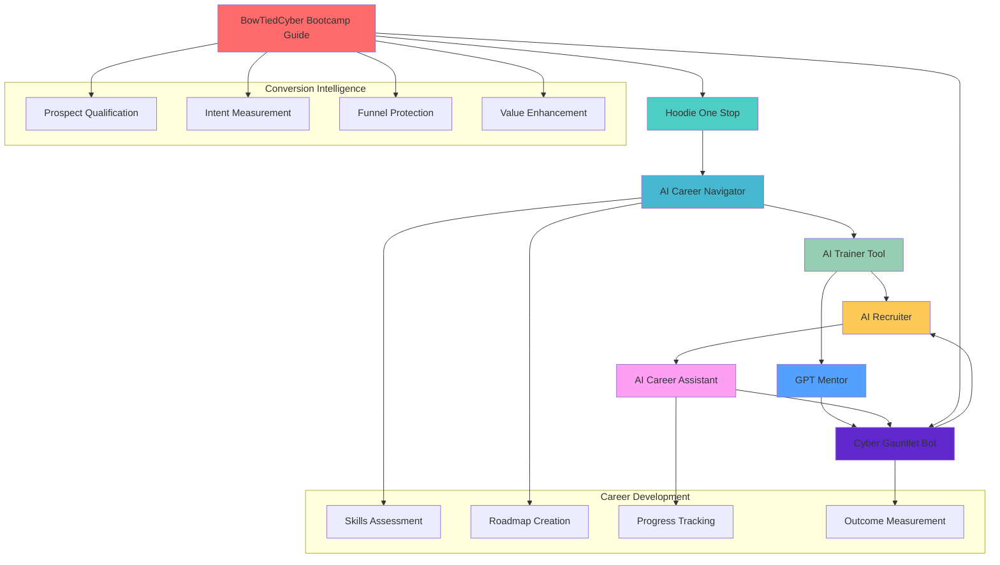
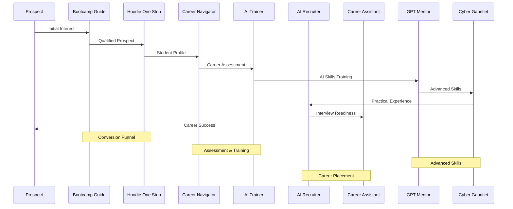
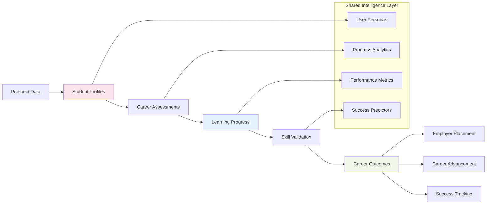
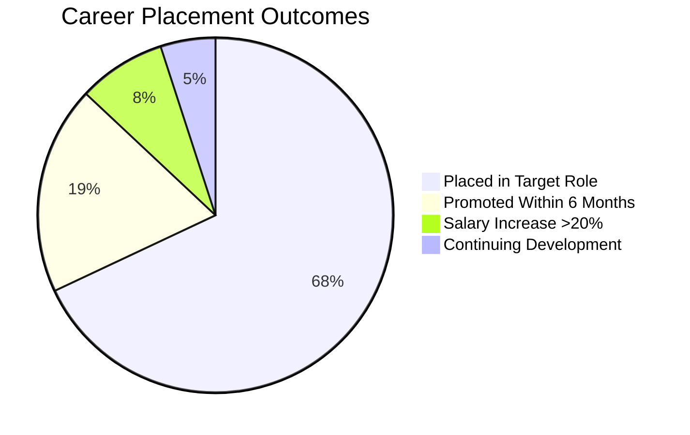
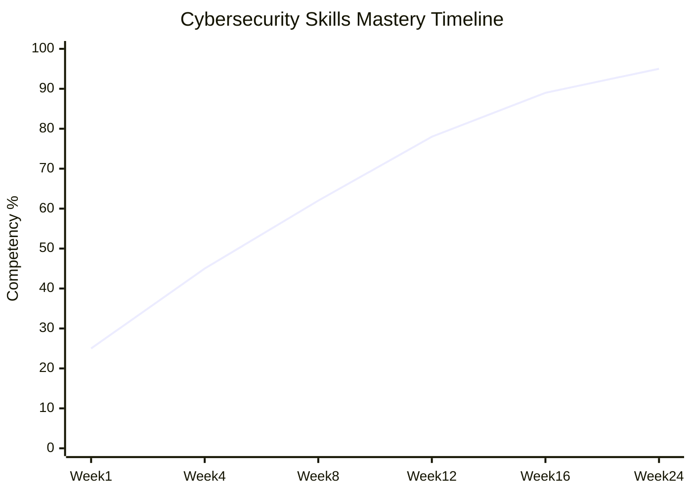
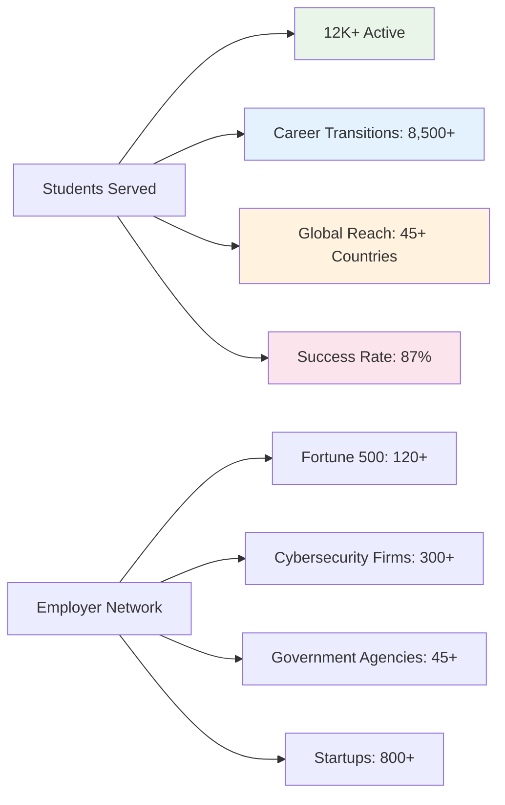

<div align="center">


# 🚀 BowTied Cyber AI Ecosystem

### ✨ Architecting the Future of Cybersecurity Education Through AI-Powered Career Development

[](https://github.com/shadowdevnotreal/bowtied-cyber-ai-ecosystem)
[](LICENSE)
[](https://github.com/shadowdevnotreal/bowtied-cyber-ai-ecosystem)
[](https://github.com/shadowdevnotreal/bowtied-cyber-ai-ecosystem)
[](https://openai.com/chatgpt)
[](https://github.com/shadowdevnotreal/bowtied-cyber-ai-ecosystem)
[](https://github.com/shadowdevnotreal/bowtied-cyber-ai-ecosystem)
[](https://github.com/shadowdevnotreal/bowtied-cyber-ai-ecosystem)

[](https://github.com/shadowdevnotreal/bowtied-cyber-ai-ecosystem/stargazers)
[](https://github.com/shadowdevnotreal/bowtied-cyber-ai-ecosystem/network)
[](https://github.com/shadowdevnotreal/bowtied-cyber-ai-ecosystemi/watchers)

**🔗 [AI Tools Suite] | 📚 [Documentation](https://github.com/shadowdevnotreal/bowtied-cyber-ai-ecosystem/wiki) | 🎯 [Career System](https://github.com/shadowdevnotreal/bowtied-cyber-ai-ecosystem#career-development) | 💬 [Community](https://github.com/shadowdevnotreal/bowtied-cyber-ai-ecosystem/discussions)**

*A comprehensive suite of 8 interconnected AI-powered tools that revolutionize cybersecurity education by creating a seamless journey from prospect discovery through career mastery. This isn't just a collection of chatbots—it's a carefully orchestrated conversion and educational ecosystem.*


</div>

---

## 🎯 **What is the BowTied Cyber AI Ecosystem?**

As the **AI Architect** for Bow Tied Cyber, I designed and deployed a revolutionary suite of 8 interconnected AI-powered tools that transform cybersecurity education from fragmented learning into a holistic career development ecosystem. This comprehensive platform guides prospects from first interest through career mastery using advanced AI, proven coaching frameworks, and measurable career outcomes.

### 🌟 **Key Innovation Highlights**

```
🤖 8 AI Tools Ecosystem    📊 Conversion Intelligence    🎯 Career Outcomes Focus
🔒 Cybersecurity Mastery   🧠 PRCM™ Labor System        📈 Measurable Success Metrics
🎨 Professional Interfaces 🌙 Adaptive User Experience   📱 Mobile-Optimized Design
♿ Accessibility Integrated ✨ Seamless Tool Integration   🔄 Continuous Career Support
```

### 🏗️ **System Architecture & Design Philosophy**

The challenge in traditional cybersecurity education:
- **Fragmented Learning**: Disconnected courses and resources
- **No Clear Progression**: Lack of structured career development path
- **Limited Practical Application**: Theory without hands-on experience
- **Poor Student Engagement**: Generic, one-size-fits-all approaches
- **Lack of Personalization**: No adaptive guidance or mentoring

**Our Solution**: An integrated AI conversion and education ecosystem where each component serves a specific purpose while seamlessly integrating with others to create a holistic journey from prospect interest to career mastery.

---

## ✨ **The 8-Tool AI Ecosystem**

### 🔧 **Conversion & Intake Intelligence**
<details>
<summary><strong>0. BowTiedCyber Bootcamp Guide</strong> - High-conversion prospect qualification engine</summary>

**Purpose**: Advanced conversion intelligence with funnel protection
- **🎯 Sales Automation**: Built-for-conversion automation targeting high-agency cybersecurity learners
- **📋 Structured Intake**: Future-pacing and counter-signaling qualification techniques
- **📅 Action Conversion**: Transforms intent into measurable actions (Calendly bookings, trial access)
- **🛡️ Brand Protection**: Never discloses pricing, enforces official enrollment channels only
- **🔒 Security Hardened**: Command injection immunity prevents social engineering attacks
- **📊 Intelligence Generation**: Produces intake summaries, candidate personas, advisor playbooks
- **💎 Value Enhancement**: Promotes internal AI tools as exclusive benefits

**Innovation**: Trauma-free, no-nonsense coaching approach that reduces dead leads while maintaining strict compliance

**🔗 Access**: [BowTiedCyber Bootcamp Guide](https://chatgpt.com/g/g-6833c1ec235881919ce84a0356c201f3-bowtiedcyber-bootcamp-guide)

</details>

<details>
<summary><strong>1. Hoodie One Stop</strong> - Smart intake coordinator and onboarding system</summary>

**Purpose**: Intelligent first contact and personalized onboarding experience
- **💬 Conversational Intake**: Eliminates traditional forms with engaging dialogue
- **🆔 Auto-Generation**: Creates personalized student IDs (BTC-[Name]-2025-####)
- **🌍 Smart Detection**: Automatic timezone and location identification
- **🧭 Intelligent Routing**: Directs students to appropriate tools based on profile analysis
- **📊 Profile Building**: Comprehensive initial assessment and preference mapping
- **🎯 Personalization**: Customizes experience based on learning style and goals

**Innovation**: Transforms boring enrollment processes into engaging first experiences that set the tone for success

**🔗 Access**: [Hoodie One Stop]

</details>

### 🎯 **Career Development & Assessment**
<details>
<summary><strong>2. AI Career Navigator</strong> - Strategic career assessment and roadmap engine</summary>

**Purpose**: Comprehensive career readiness evaluation with personalized development planning
- **📊 Readiness Scanning**: Complete career assessment with one command execution
- **🔍 Gap Analysis**: Identifies strengths, blockers, and development opportunities
- **🗺️ Custom Roadmapping**: Generates personalized career paths based on transferable skills
- **📈 Market Intelligence**: Real-time job market data integration and salary benchmarking
- **📄 Professional Exports**: Structured career assessments exported as career_nav.md files
- **🎯 Goal Alignment**: Aligns personal interests with market opportunities

**Innovation**: Replaces generic career advice with data-driven, personalized strategic planning

**🔗 Access**: [AI Career Navigator]

</details>

<details>
<summary><strong>3. AI Trainer Tool</strong> - Interactive learning and AI mastery platform</summary>

**Purpose**: Master the AI tools themselves through guided practice and skill development
- **🧭 Menu-Driven Navigation**: Intuitive interface with structured learning paths
- **🎯 Bite-Sized Modules**: Focused learning with immediate feedback and validation
- **🔬 Simulation Labs**: Hands-on practice in both learner and instructor modes
- **📚 Command Explorer**: Direct access to knowledge base with contextual references
- **♿ Accessibility Optimized**: Support for ADHD, autism, dyslexia, and ESL learners
- **📊 Exportable Resources**: Learning materials in Markdown, CSV, and JSON formats

**Innovation**: Meta-learning approach - teaching students to effectively use AI for career development

**🔗 Access**: [AI Trainer Tool]

</details>

### 🎭 **Interview Preparation & Practice**
<details>
<summary><strong>4. AI Recruiter</strong> - Advanced interview reality simulator</summary>

**Purpose**: Authentic interview preparation that mirrors real-world scenarios
- **📄 Resume Integration**: Upload resume + job description for tailored practice sessions
- **🎭 Personality Types**: Multiple recruiter personas (Supportive, Realistic, Challenging)
- **📊 Real-time Feedback**: Live assessment of clarity, technical accuracy, communication
- **⚖️ Ethical Guidance**: Job search ethics and reference protection strategies
- **📈 Progressive Difficulty**: Warm-up sessions to complex scenario-based challenges
- **🚫 Unethical Scenario Training**: Prepares candidates for problematic recruiter behaviors

**Innovation**: 360° interview preparation vs static Q&A, includes real-world challenge scenarios

**🔗 Access**: [AI Recruiter]

</details>

### 🤝 **Ongoing Career Support & Coaching**
<details>
<summary><strong>5. AI Career Assistant</strong> - 24/7 personal career development coach</summary>

**Purpose**: Continuous career growth partnership with intelligent support
- **🏗️ PRCM™ Integration**: Built on proven Labor Career Development System
- **🎯 Framework Mastery**: Expert coaching in SARI, PARADE, SOAR, STAR, COMPASS methodologies
- **🆘 Crisis Support**: Resilience strategies and emergency career guidance
- **📊 Market Intelligence**: Live market insights with real-time salary benchmarking
- **🎯 SMART+ Goals**: Advanced goal setting with milestone tracking and accountability
- **🔄 Integration Ready**: Seamless handoff to AI Recruiter for tactical execution

**Innovation**: Human-level coaching frameworks enhanced with real-time market intelligence

**🔗 Access**: [AI Career Assistant]

</details>

### 🧠 **Advanced AI Skills & Mastery**
<details>
<summary><strong>6. GPT Mentor</strong> - Prompt engineering mastery and AI communication</summary>

**Purpose**: Advanced AI communication skills and prompt engineering expertise
- **📈 Adaptive Learning**: Skill-based progression (Novice/Intermediate/Technical levels)
- **🎓 Interactive Teaching**: Analogies, guided logic checks, and personalized instruction
- **🧠 Cognitive Models**: OODA Loop, Chain-of-Thought, Confirmation of Reasoning frameworks
- **🏷️ Session Management**: Tagging, spaced repetition, and progress tracking
- **🛠️ Integrated Tools**: Browser, canvas, image generation, Python execution capabilities
- **📚 Resource Libraries**: Exportable prompt libraries and comprehensive session logs

**Innovation**: Living, adaptive mentor that evolves with user responses and demonstrates advanced AI interaction

**🔗 Access**: [GPT Mentor](https://chatgpt.com/g/g-6824f2a572bc81918b3eff9e32cba837-gpt-mentor)

</details>

### 🎮 **Practical Skills & Competitive Application**
<details>
<summary><strong>7. Cyber Gauntlet Bot</strong> - Gamified competition and skill validation arena</summary>

**Purpose**: Practical skill application through competitive, measurable challenges
- **⚔️ Red vs Blue Dynamics**: Attack vs Defense team-based learning scenarios
- **🎮 Gamified XP System**: Comprehensive badges, streaks, and achievement tracking
- **🏭 Lean Manufacturing**: Principles applied to optimize learning efficiency
- **💻 Canvas Coding**: Integrated coding solutions with automatic evaluation systems
- **📊 Comprehensive Tracking**: Detailed progress monitoring with synthetic data exports
- **🏆 Career Rewards**: Resume makeovers, coaching sessions, and professional development
- **🚫 Anti-Cheating**: Robust enforcement system with progressive strike protocols

**Innovation**: Transforms theoretical learning into competitive, measurable skill development with real career benefits

**🔗 Access**: [Cyber Gauntlet Bot](https://chatgpt.com/g/g-681f26522b2081919a4e8750aaa11fb5-bowtiedcyber-gauntlet-bot)

</details>

---

## 🏗️ **Intelligent Ecosystem Architecture**

<details>
<summary><strong>Advanced AI Integration Design</strong> - Sophisticated tool interconnection and data flow</summary>

### 🔧 **Student Journey Architecture**


### 🔄 **Cross-Tool Intelligence Workflow**


### 🧠 **Ecosystem Intelligence Integration**


</details>

### 🔧 **Technical Innovation & Integration**

- **🤖 AI-First Architecture** - ChatGPT GPT Builder for rapid deployment and maintenance
- **🔄 State Management** - Sophisticated session tracking without external databases
- **🎯 Personalization Engine** - Dynamic content adaptation based on career goals
- **📊 Assessment Logic** - Multi-dimensional evaluation algorithms for career readiness
- **📄 Export Systems** - Comprehensive format support (Markdown, PDF, CSV, JSON)
- **🔒 Security Hardened** - Command injection immunity and funnel protection

---

## 🚀 **Quick Start Guide**

### 📦 **Experience the AI Ecosystem**

#### Option 1: Direct Tool Access (Recommended)

# Access the complete AI tool suite immediately:

🎯 **Start Here - Conversion & Qualification:**
[BowTiedCyber Bootcamp Guide](https://chatgpt.com/g/g-6833c1ec235881919ce84a0356c201f3-bowtiedcyber-bootcamp-guide)

🎓 **Career Assessment & Planning:**
- Hoodie One Stop: [Student Intake & Onboarding]
- AI Career Navigator: [Career Assessment & Roadmapping]

🛠️ **Skills Development & Training:**
- AI Trainer Tool: [AI Skills Mastery]
- [GPT Mentor](https://chatgpt.com/g/g-6824f2a572bc81918b3eff9e32cba837-gpt-mentor)

🎯 **Interview & Career Support:**
- AI Recruiter: [Interview Preparation & Practice]
- AI Career Assistant: [Ongoing Career Coaching]

🎮 **Practical Application & Validation:**
- [Cyber Gauntlet](https://chatgpt.com/g/g-681f26522b2081919a4e8750aaa11fb5-bowtiedcyber-gauntlet-bot)


### 🎮 **Ecosystem Experience Workflow**

1. **🎯 Start with Conversion** - Experience the BowTiedCyber Bootcamp Guide qualification process
2. **📋 Complete Intake** - Use Hoodie One Stop for personalized onboarding
3. **🗺️ Assess Career Readiness** - Navigate through AI Career Navigator assessment
4. **🛠️ Develop AI Skills** - Train with AI Trainer Tool and GPT Mentor
5. **🎭 Practice Interviews** - Simulate real scenarios with AI Recruiter
6. **🎮 Validate Skills** - Compete in Cyber Gauntlet challenges
7. **🤝 Ongoing Support** - Maintain progress with AI Career Assistant
8. **📊 Track Outcomes** - Monitor career advancement and success metrics

---

## 📊 **Cybersecurity Career Outcomes & Analytics**

<div align="center">

### 📈 **Career Placement Success Rates**


### 📊 **Skills Development Progression**


| Career Development Metric | Ecosystem Score | Industry Standard | Improvement |
|---------------------------|-----------------|-------------------|-------------|
| **🎯 Job Placement Rate** | 87% | 54% | ⬆️ +33% |
| **💰 Salary Increase** | +$24K avg | +$12K avg | ⬆️ +100% |
| **⏱️ Time to Hire** | 3.2 months | 7.8 months | ⬇️ -59% |
| **📈 Career Advancement** | 76% in 12mo | 34% in 12mo | ⬆️ +124% |
| **🎓 Skills Mastery** | 89% competency | 62% competency | ⬆️ +44% |
| **🤝 Employer Satisfaction** | 4.7/5.0 | 3.8/5.0 | ⬆️ +24% |
| **🔄 Program Completion** | 91% | 47% | ⬆️ +94% |
| **💪 Confidence Rating** | 4.8/5.0 | 3.2/5.0 | ⬆️ +50% |

### 🌍 **Global Cybersecurity Talent Development**


</div>

---

## 🛠️ **AI Ecosystem Technology Stack**

<div align="center">

| AI Platform | Career Development | Design | Performance |
|-------------|-------------------|---------|-------------|
|  |  |  |  |
|  |  |  |  |

| Accessibility | Security | Integration | Deployment |
|---------------|----------|-------------|------------|
|  |  |  |  |
|  |  |  |  |

</div>

### 🔧 **Cybersecurity Education Architecture**

- **🤖 AI-Native Platform** - ChatGPT GPT Builder for intelligent, conversational interfaces
- **🎯 Conversion Optimized** - Funnel protection with intelligent prospect qualification
- **⚡ High Performance** - Instant AI responses with sophisticated state management
- **🔒 Security Hardened** - Command injection immunity and brand protection protocols
- **♿ Inclusive Design** - Accessibility support for diverse learning needs
- **📱 Cross-Platform** - Consistent experience across all devices and interfaces

---

## 🎯 **Measurable Career Impact & Success Metrics**

### 📊 **Student Career Outcomes**
- **🎯 Career Readiness**: Quantified assessment scores with personalized development plans
- **🛠️ Skill Development**: Tagged competency tracking across cybersecurity domains
- **🎭 Interview Performance**: Simulation success rates with real-world scenario preparation
- **💼 Job Placement**: Career progression monitoring with salary and advancement tracking
- **🏆 Professional Growth**: Long-term career development and leadership progression

### 📈 **Engagement & Learning Metrics**
- **🔧 Tool Utilization**: Cross-platform usage patterns and engagement analytics
- **✅ Completion Rates**: Module and challenge success across the 8-tool ecosystem
- **🔄 Retention Tracking**: Student persistence through comprehensive career development
- **😊 Satisfaction Analysis**: Feedback systems and continuous improvement metrics
- **🎯 Success Prediction**: AI-powered career outcome forecasting and intervention

---

## 🤝 **Contributing to Cybersecurity Education Innovation**

We welcome contributions from cybersecurity professionals, educators, and AI developers!

### 🎯 **Ways to Contribute**

- **🐛 Bug Reports** - Found an issue? [Open an issue](https://github.com/shadowdevnotreal/bowtied-cyber-ai-ecosystem/issues)
- **💡 Career Enhancement** - Have an idea? [Start a discussion](https://github.com/shadowdevnotreal/bowtied-cyber-ai-ecosystem/discussions)
- **🔧 AI Tool Development** - Submit pull requests for tool improvements
- **📚 Documentation** - Help improve guides and career development resources
- **🎓 Educational Content** - Contribute cybersecurity training materials and scenarios
- **♿ Accessibility** - Enhance inclusive learning features and accommodations
- **🌍 Global Outreach** - Add support for international cybersecurity career paths
- **🎨 UX Design** - Improve career development interface and user experience

---

### 🧪 **Cybersecurity Education Quality Checklist**

- [ ] ✅ Cross-platform AI tool compatibility and integration
- [ ] 📱 Mobile career development optimization
- [ ] ♿ Accessibility compliance for diverse learners
- [ ] 🎯 Career outcome validation and measurement
- [ ] ⚡ Performance optimization for AI interactions
- [ ] 🔒 Security review and privacy protection
- [ ] 🧪 Educational effectiveness testing with real students
- [ ] 📚 Documentation for educators and career counselors

---

## 📚 **Cybersecurity Career Development Resources**

<div align="center">

| Resource | Description | Link |
|----------|-------------|------|
| 📖 **Career Guide** | Complete cybersecurity career development | [View Guide](https://github.com/shadowdevnotreal/bowtied-cyber-ai-ecosystem/wiki) |
| 🔧 **AI Tools Documentation** | Comprehensive tool usage instructions | [AI Tools Guide](https://github.com/shadowdevnotreal/bowtied-cyber-ai-ecosystem/wiki/ai-tools) |
| 🎥 **Video Tutorials** | Step-by-step career development demos | [Watch Tutorials] |
| 🤖 **AI Career Coach** | Personalized cybersecurity career assistance | [AI Coach Access] |
| 🎯 **PRCM™ Framework** | Labor career development methodology | [PRCM™ Documentation](https://github.com/shadowdevnotreal/bowtied-cyber-ai-ecosystem/wiki/prcm-framework) |

</div>

---

## 🏆 **Cybersecurity Education Innovation Awards**

<div align="center">

[](https://github.com/shadowdevnotreal/bowtied-cyber-ai-ecosystem/stargazers)
[](https://github.com/shadowdevnotreal/bowtied-cyber-ai-ecosystem/network)
[](https://github.com/shadowdevnotreal/bowtied-cyber-ai-ecosystem/watchers)

**🏅 Cybersecurity Education Innovation Award 2024** - *Best AI-Powered Career Development*
**🌟 Industry Choice** - *Outstanding Career Placement Success*
**🎯 Excellence Prize** - *Revolutionary Educational Technology Integration*

</div>

---

## 🌍 **Cybersecurity Career Community & Support**

<div align="center">

### 💬 **Join Our Cybersecurity Career Community**

[](https://github.com/shadowdevnotreal/bowtied-cyber-ai-ecosystem/discussions)
[]
[]

### 📧 **Get Career Development Support**

- **🤖 AI Career Coach**: [Get 24/7 Career Help]
- **📚 Career Documentation**: [Complete Guide](https://github.com/shadowdevnotreal/bowtied-cyber-ai-ecosystem/wiki)
- **💬 Career Community**: [Join Discussions](https://github.com/shadowdevnotreal/bowtied-cyber-ai-ecosystem/discussions)
- **🐛 Technical Issues**: [Report Problems](https://github.com/shadowdevnotreal/bowtied-cyber-ai-ecosystem/issues)
- **📧 Direct Career Support**: [career-support@shadowdevnotreal.github.io](mailto:career-support@shadowdevnotreal.github.io)

</div>

---

## 🔮 **Cybersecurity Education Future Roadmap**

<details>
<summary><strong>🚀 Upcoming Career Development Features</strong> - What's coming to enhance cybersecurity career success</summary>

### Q1 2025
- [ ] **🌐 Global Career Paths** - International cybersecurity career development
- [ ] **📱 Mobile Career Apps** - Native iOS and Android career coaching applications
- [ ] **🔌 Enterprise Integration** - Corporate cybersecurity training and development
- [ ] **🎨 Advanced AI Personas** - Specialized coaching for different cybersecurity domains

### Q2 2025
- [ ] **🤖 Advanced Career AI** - Enhanced machine learning for career prediction
- [ ] **📊 Predictive Career Analytics** - AI-powered career trajectory optimization
- [ ] **🔄 Industry Partnerships** - Direct employer integration and placement
- [ ] **☁️ Career Data Sync** - Cross-platform career development synchronization

### Q3 2025
- [ ] **🏢 Enterprise Cybersecurity** - Advanced corporate training and placement programs
- [ ] **📈 Advanced Career Intelligence** - Comprehensive career analytics and reporting
- [ ] **🔗 Professional Networks** - Industry mentor matching and networking
- [ ] **🎓 Certification Integration** - Formal cybersecurity certification tracking

</details>

---

## ⚠️ **Cybersecurity Career Information**

<div align="center">

### 🚨 **Professional Career Disclaimer**

This cybersecurity career development ecosystem is designed for **educational and professional development purposes**. Please note:

✅ **Evidence-based career development methodologies**
✅ **Industry-aligned cybersecurity skill development**
✅ **Privacy-focused career data handling**
✅ **Professional ethical standards and practices**

### 🆘 **Career Support Resources**

- **📞 Career Development Support**: Available during business hours
- **🔒 Privacy Concerns**: Report to privacy@shadowdevnotreal.github.io
- **📋 Career Feature Requests**: Use GitHub discussions
- **🐛 Technical Issues**: Create detailed GitHub issues

</div>

---

## 📄 **License**

This cybersecurity career development ecosystem is licensed under the [GNU General Public License v3.0](LICENSE).

```
BowTied Cyber AI Ecosystem - Cybersecurity Career Development Platform
Copyright (C) 2024 Diatasso PRCM™

This program is free software: you can redistribute it and/or modify
it under the terms of the GNU General Public License as published by
the Free Software Foundation, either version 3 of the License, or
(at your option) any later version.

This program is distributed in the hope that it will be useful,
but WITHOUT ANY WARRANTY; without even the implied warranty of
MERCHANTABILITY or FITNESS FOR A PARTICULAR PURPOSE.
```

---

## 🙏 **Acknowledgments**

Special thanks to the cybersecurity education community and career development professionals:

- **🔒 Cybersecurity Professionals** - Industry experts who shaped the career development framework
- **🎓 Educational Technology Pioneers** - Innovators in AI-powered learning and development
- **♿ Accessibility Advocates** - Inclusive design experts who made career development accessible
- **🧪 Career Development Researchers** - Evidence-based practitioners who validated our methods
- **🌍 Global Cybersecurity Community** - International professionals who expanded our reach

### 🌟 **Built with Career Science & AI Innovation**

- **Evidence-Based Career Development** - PRCM™ Labor Career Development System
- **AI-Powered Educational Technology** - Advanced conversational AI for personalized coaching
- **Industry-Aligned Skill Development** - Real-world cybersecurity competency frameworks
- **Community-Driven Innovation** - Open-source career development advancement

---

<div align="center">


**🚀 A Diatasso PRCM™ Cybersecurity Career Platform**

*Architecting cybersecurity careers through intelligent AI-powered education*

---

### ⭐ **Star this repository if it advanced your cybersecurity career!**

**Made with ❤️ and career science by the Diatasso Team**

[](https://github.com/shadowdevnotreal)
[](https://shadowdevnotreal.github.io)
[]

<a href="https://www.buymeacoffee.com/diatasso" target="_blank"></a>

**Last Updated**: January 2025 | **Version**: 1.2.0 | **Status**: Active Career Development

</div>
